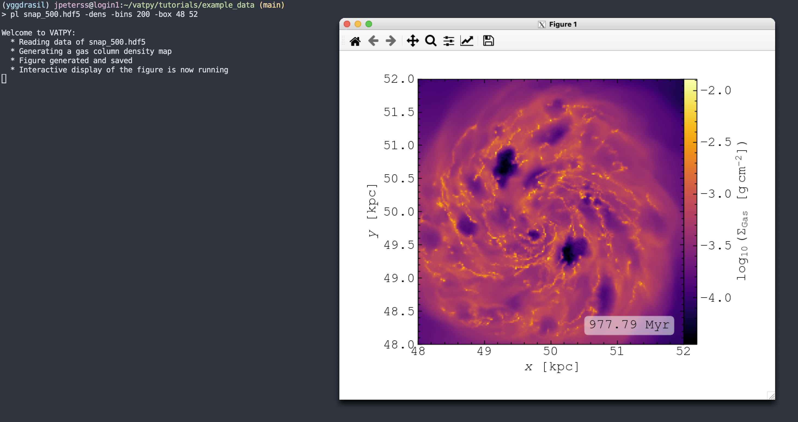

# Welcome to Vatpy

Vatpy (Visualisation of Arepo in the Terminal using PYthon) is a light-weight, highly customisable, visualisation tool-kit for astrophysical simulations performed using the Arepo code (Springel 2010). 
Many of its functions can be generally applied to simulations made by Arepo (as long as the output is in HDF5-format), however, more specific capabilities, 
such as creating visual maps of the gas chemistry, is at the moment only adapted to simulations run using the ArepoNoctua numerical framework (see Petersson et al. 2025).

## Installation

**Requirements**
> `numpy`, `matplotlib`

### Quick Version:
- Download the repository to your home directory
- 

## Usage
### How to Make Plots in the Terminal

#### GUI Version

#### CLI Version

## Contributions
**Jonathan Petersson** - *PhD Student @ EPFL* - jonathan.petersson@epfl.ch

## License
Distributed under the MIT license (see LICENSE.md for more information).
