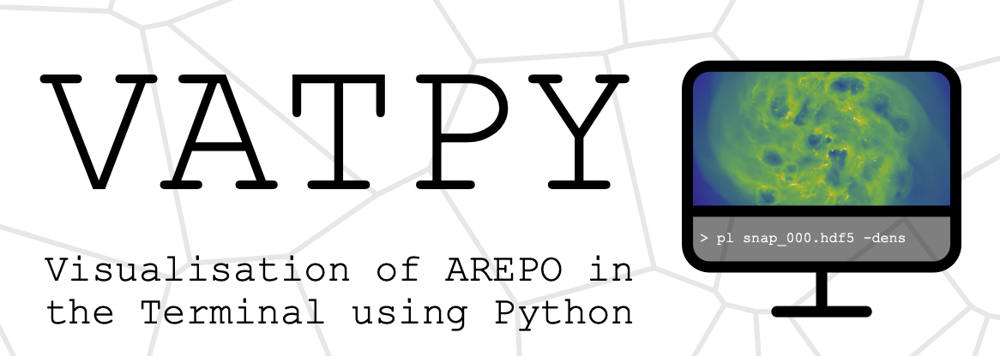

# Welcome to Vatpy
Vatpy (Visualisation of Arepo in the Terminal using PYthon) is a light-weight, highly customisable, visualisation tool-kit for astrophysical simulations performed using the Arepo code (Springel 2010). 
Many of its functions can be generally applied to simulations made by Arepo (as long as the output is in HDF5-format), however, more specific capabilities, 
such as creating visual maps of the gas chemistry, is at the moment only adapted to simulations run using the ArepoNoctua numerical framework (see Petersson et al. 2025).



## Installation
In this section, we provide some general guidelines to install and set up Vatpy on your own machine.

### Requirements
> `python`, `numpy`, `matplotlib`, `mpl_toolkits`, `scipy`, `h5py`, `labellines`, `pycstruct`

### Quick Guide:
- Download the repository to your home directory
- Include the path of the Vatpy directory to your PYTHONPATH variable, e.g. you can add the following command to your .bashrc or .bash_profile file:
  ```shell
  export PYTHONPATH=$PYTHONPATH:$HOME/vatpy
  ```
- Now, go the Vatpy directory and make a copy of configv-template.py, and rename it to configv.py (do NOT move the file to any other directory). The file: configv.py, is your personal configuration of Vapty, and can be modified as you wish. Important! Before using Vatpy, make sure to change the variable: homedir, to the path of your home directory (where Vatpy should be installed). 
- Voilà, that's it, you should now be ready to use Vatpy in the terminal, Jupyter Notebooks, Python scripts, etc. To verify that Vatpy is installed properly, try:
  ```python
  import vatpy as vp
  ```
- If you have issues installing Vatpy, do not hesitate to contact one of the main contributors (see the Contributions section below for contact details)

## Usage
Here, we provide a short overview on how to use Vatpy directly in the terminal, as well as in Jupyer Notebooks.

### How to use Vatpy in the Terminal
*TODO*

#### GUI Version
*Still under development...*

#### CLI Version
*Still under development...*

### How to use Vatpy in Jupyter Notebooks
*TODO*

## Contributions
**Jonathan Petersson** - *PhD Student @ EPFL* - jonathan.petersson@epfl.ch

## License
Distributed under the MIT license (see LICENSE.md for more information).