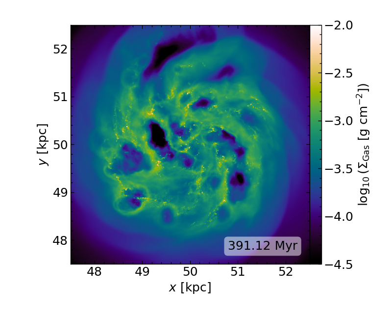
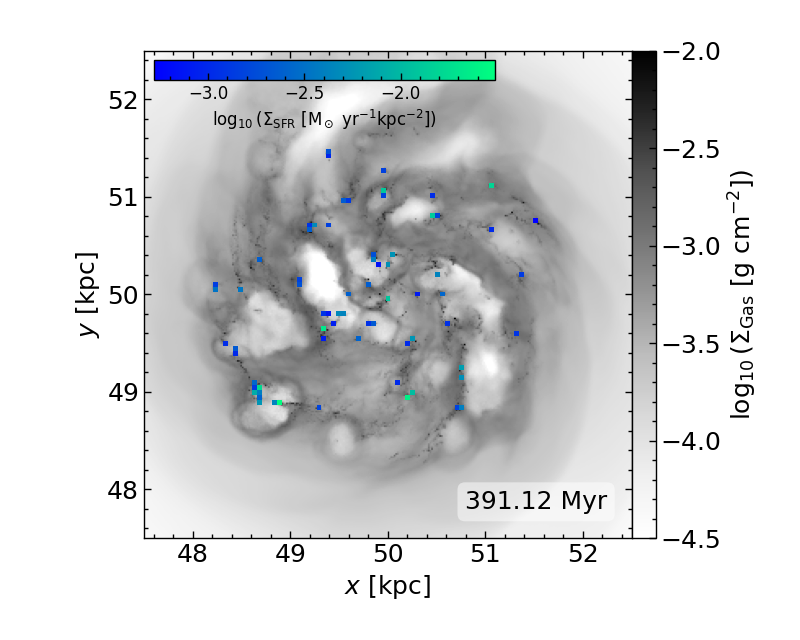
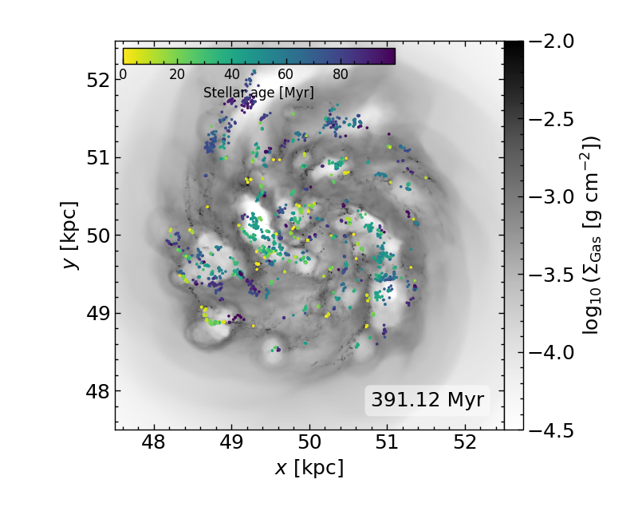

# Welcome to Vatpy

Vatpy (Visualisation of Arepo in the Terminal using PYthon) is a light-weight,
highly customisable, visualisation tool-kit for astrophysical simulations
performed using the Arepo code (Springel 2010). 

Many of its functionalities can be generally applied to simulations made by Arepo
(as long as the output is in HDF5-format), however, more specific capabilities, 
such as creating visual maps of the gas chemistry, is at the moment only adapted
to simulations run using the ArepoNoctua numerical framework (Petersson et al. 2025).

## Example Gallery

Below you can see a set of visual maps from the Noctua suite of simulations
(Petersson et al. 2025), highlighting some key quantities, such as the total column
density of gas (top left), the average gas temperature (top right), the star formation
rate surface density (bottom left), and the stellar age of newly formed star particles
(bottom right), in a simulated low-mass dwarf galaxy at approximately 400 Myr in its evolution.

  
  
  
  

<i>Visual maps of a simulated low-mass dwarf galaxy from the Noctua suite of simulations
(Petersson et al. 2025), made using Vatpy</i>

  

<i>Used by researchers at</i> 

 
Last updated: 2025-09-04
